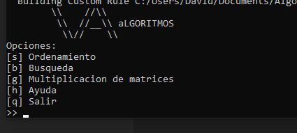

# Algoritmos

#### Este repositorio contiene algoritmos comunes implementados en C++. Se implemento una interfaz para demostrar el funcionamiento de cada algoritmo:  
  

#### Al momento, las funciones disponibles son:
    - Ordenamiento
    - Multiplicacion de matrices
  
### Ordenamiento
Implementación de algoritmo Quicksort + Insertion sort.  
Ordena vectores largos de numeros enteros (int) con el metodo quicksort para sectores largos y con el metodo de insercion para sectores cortos del vector.  
En la demo se crean vectores con numeros aleatorios y se ordenan. Se realizan iteraciones de ordenamiento y se calcula un promedio de tiempo que se tarda en procesar.

### Multiplicacion de matrices
Implementacion del algoritmo de multiplicacion de matrices simple.  
En la demo se crean 2 matrices y, si es posible multiplicarlas, se almacena el resultado en una tercera matriz.  
Se calcula el tiempo de ejecucion